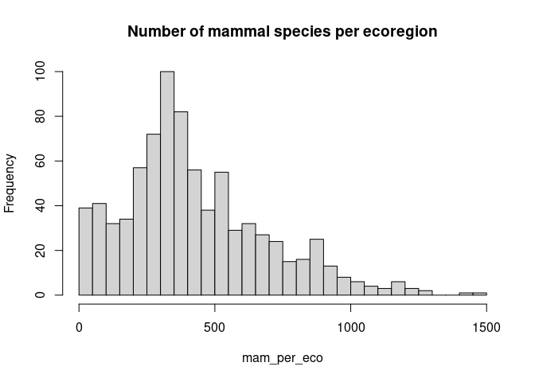

# Introduction

Dans cet exercice nous allons utiliser le package `dplyr` pour nous instruire sur la biogéographie des ours.

# Données

On utilise la base [**WWF Wildfinder**](https://www.worldwildlife.org/pages/wildfinder-database)

La base de données WildFinder du WWF contient des données de présence/absence pour les amphibiens, reptiles, oiseaux et mammifères terrestres du monde entier au niveau des écorégions terrestres. Seul le sous-ensemble des mammifères est disponible dans ce dépôt avec 4936 espèces. Les données, préalablement nettoyées, sont structurées de la manière suivante dans le dossier `data/wwf-wildfinder/` :

  - `wildfinder-mammals_list.csv` : liste taxonomique des 4936 espèces de mammifères du monde entier
  - `wildfinder-ecoregions_list.csv` : liste des 798 écorégions terrestres définies par le WWF
  - `wildfinder-ecoregions_species.csv` : correspondances entre les espèces et les écorégions

# Analyses

## Exploration des données

- Histogramme de la distribution du nombre d'espèces de mammifères par écorégion.


```r
#read wildfinder-ecoregions_species.csv
sp_eco <- datatoolboxexos::data_mammals_ecoregions()
```

```
## 
## ── Column specification ──────────────────────────────────────────────────────────────
## cols(
##   ecoregion_id = col_character(),
##   species_id = col_double()
## )
```

```r
#read wildfinder-ecoregions.csv
eco_list <- datatoolboxexos::data_ecoregion()
```

```
## 
## ── Column specification ──────────────────────────────────────────────────────────────
## cols(
##   ecoregion_id = col_character(),
##   ecoregion = col_character(),
##   realm = col_character(),
##   biome = col_character()
## )
```

```r
#read wildfinder-species.csv
sp_list <- datatoolboxexos::data_mammals()
```

```
## 
## ── Column specification ──────────────────────────────────────────────────────────────
## cols(
##   species_id = col_double(),
##   class = col_character(),
##   order = col_character(),
##   family = col_character(),
##   genus = col_character(),
##   species = col_character(),
##   common = col_character(),
##   sci_name = col_character()
## )
```

```r
#tabulate the ecoregions
mam_per_eco <- table(sp_eco$ecoregion_id)
#histogram
hist(mam_per_eco,
     main = "Number of mammal species per ecoregion",
     breaks = 50
)
```

<!-- -->

# Les Ours


```r
Ursus <- datatoolboxexos::select_ursus(sp_list = sp_list) %>%
  datatoolboxexos::joints_ursus_eco(sp_eco = sp_eco, eco_list = eco_list)
```

```
## Joining, by = "species_id"
```

```r
Ursus_realm <- datatoolboxexos::get_realm_nb(Ursus)
Ursus_eco <- datatoolboxexos::get_ecoregions_nb(Ursus)
Ursus_biome <- datatoolboxexos::get_biome_nb(Ursus)

Ursus_final <- datatoolboxexos::combine_all_ursus(Ursus_biome, Ursus_eco, Ursus_realm, Ursus)
print(Ursus_final, n=Inf)
```

```
## # A tibble: 389 x 5
##     sci_name               common              n_realms n_biomes n_ecoregions
##     <chr>                  <chr>                  <int>    <int>        <int>
##   1 Ursus arctos           Brown Bear                 3       11          139
##   2 Ursus arctos           Brown Bear                 3       11          139
##   3 Ursus arctos           Brown Bear                 3       11          139
##   4 Ursus arctos           Brown Bear                 3       11          139
##   5 Ursus arctos           Brown Bear                 3       11          139
##   6 Ursus arctos           Brown Bear                 3       11          139
##   7 Ursus arctos           Brown Bear                 3       11          139
##   8 Ursus arctos           Brown Bear                 3       11          139
##   9 Ursus arctos           Brown Bear                 3       11          139
##  10 Ursus arctos           Brown Bear                 3       11          139
##  11 Ursus arctos           Brown Bear                 3       11          139
##  12 Ursus arctos           Brown Bear                 3       11          139
##  13 Ursus arctos           Brown Bear                 3       11          139
##  14 Ursus arctos           Brown Bear                 3       11          139
##  15 Ursus arctos           Brown Bear                 3       11          139
##  16 Ursus arctos           Brown Bear                 3       11          139
##  17 Ursus arctos           Brown Bear                 3       11          139
##  18 Ursus arctos           Brown Bear                 3       11          139
##  19 Ursus arctos           Brown Bear                 3       11          139
##  20 Ursus arctos           Brown Bear                 3       11          139
##  21 Ursus arctos           Brown Bear                 3       11          139
##  22 Ursus arctos           Brown Bear                 3       11          139
##  23 Ursus arctos           Brown Bear                 3       11          139
##  24 Ursus arctos           Brown Bear                 3       11          139
##  25 Ursus arctos           Brown Bear                 3       11          139
##  26 Ursus arctos           Brown Bear                 3       11          139
##  27 Ursus arctos           Brown Bear                 3       11          139
##  28 Ursus arctos           Brown Bear                 3       11          139
##  29 Ursus arctos           Brown Bear                 3       11          139
##  30 Ursus arctos           Brown Bear                 3       11          139
##  31 Ursus arctos           Brown Bear                 3       11          139
##  32 Ursus arctos           Brown Bear                 3       11          139
##  33 Ursus arctos           Brown Bear                 3       11          139
##  34 Ursus arctos           Brown Bear                 3       11          139
##  35 Ursus arctos           Brown Bear                 3       11          139
##  36 Ursus arctos           Brown Bear                 3       11          139
##  37 Ursus arctos           Brown Bear                 3       11          139
##  38 Ursus arctos           Brown Bear                 3       11          139
##  39 Ursus arctos           Brown Bear                 3       11          139
##  40 Ursus arctos           Brown Bear                 3       11          139
##  41 Ursus arctos           Brown Bear                 3       11          139
##  42 Ursus arctos           Brown Bear                 3       11          139
##  43 Ursus arctos           Brown Bear                 3       11          139
##  44 Ursus arctos           Brown Bear                 3       11          139
##  45 Ursus arctos           Brown Bear                 3       11          139
##  46 Ursus arctos           Brown Bear                 3       11          139
##  47 Ursus arctos           Brown Bear                 3       11          139
##  48 Ursus arctos           Brown Bear                 3       11          139
##  49 Ursus arctos           Brown Bear                 3       11          139
##  50 Ursus arctos           Brown Bear                 3       11          139
##  51 Ursus arctos           Brown Bear                 3       11          139
##  52 Ursus arctos           Brown Bear                 3       11          139
##  53 Ursus arctos           Brown Bear                 3       11          139
##  54 Ursus arctos           Brown Bear                 3       11          139
##  55 Ursus arctos           Brown Bear                 3       11          139
##  56 Ursus arctos           Brown Bear                 3       11          139
##  57 Ursus arctos           Brown Bear                 3       11          139
##  58 Ursus arctos           Brown Bear                 3       11          139
##  59 Ursus arctos           Brown Bear                 3       11          139
##  60 Ursus arctos           Brown Bear                 3       11          139
##  61 Ursus arctos           Brown Bear                 3       11          139
##  62 Ursus arctos           Brown Bear                 3       11          139
##  63 Ursus arctos           Brown Bear                 3       11          139
##  64 Ursus arctos           Brown Bear                 3       11          139
##  65 Ursus arctos           Brown Bear                 3       11          139
##  66 Ursus arctos           Brown Bear                 3       11          139
##  67 Ursus arctos           Brown Bear                 3       11          139
##  68 Ursus arctos           Brown Bear                 3       11          139
##  69 Ursus arctos           Brown Bear                 3       11          139
##  70 Ursus arctos           Brown Bear                 3       11          139
##  71 Ursus arctos           Brown Bear                 3       11          139
##  72 Ursus arctos           Brown Bear                 3       11          139
##  73 Ursus arctos           Brown Bear                 3       11          139
##  74 Ursus arctos           Brown Bear                 3       11          139
##  75 Ursus arctos           Brown Bear                 3       11          139
##  76 Ursus arctos           Brown Bear                 3       11          139
##  77 Ursus arctos           Brown Bear                 3       11          139
##  78 Ursus arctos           Brown Bear                 3       11          139
##  79 Ursus arctos           Brown Bear                 3       11          139
##  80 Ursus arctos           Brown Bear                 3       11          139
##  81 Ursus arctos           Brown Bear                 3       11          139
##  82 Ursus arctos           Brown Bear                 3       11          139
##  83 Ursus arctos           Brown Bear                 3       11          139
##  84 Ursus arctos           Brown Bear                 3       11          139
##  85 Ursus arctos           Brown Bear                 3       11          139
##  86 Ursus arctos           Brown Bear                 3       11          139
##  87 Ursus arctos           Brown Bear                 3       11          139
##  88 Ursus arctos           Brown Bear                 3       11          139
##  89 Ursus arctos           Brown Bear                 3       11          139
##  90 Ursus arctos           Brown Bear                 3       11          139
##  91 Ursus arctos           Brown Bear                 3       11          139
##  92 Ursus arctos           Brown Bear                 3       11          139
##  93 Ursus arctos           Brown Bear                 3       11          139
##  94 Ursus arctos           Brown Bear                 3       11          139
##  95 Ursus arctos           Brown Bear                 3       11          139
##  96 Ursus arctos           Brown Bear                 3       11          139
##  97 Ursus arctos           Brown Bear                 3       11          139
##  98 Ursus arctos           Brown Bear                 3       11          139
##  99 Ursus arctos           Brown Bear                 3       11          139
## 100 Ursus arctos           Brown Bear                 3       11          139
## 101 Ursus arctos           Brown Bear                 3       11          139
## 102 Ursus arctos           Brown Bear                 3       11          139
## 103 Ursus arctos           Brown Bear                 3       11          139
## 104 Ursus arctos           Brown Bear                 3       11          139
## 105 Ursus arctos           Brown Bear                 3       11          139
## 106 Ursus arctos           Brown Bear                 3       11          139
## 107 Ursus arctos           Brown Bear                 3       11          139
## 108 Ursus arctos           Brown Bear                 3       11          139
## 109 Ursus arctos           Brown Bear                 3       11          139
## 110 Ursus arctos           Brown Bear                 3       11          139
## 111 Ursus arctos           Brown Bear                 3       11          139
## 112 Ursus arctos           Brown Bear                 3       11          139
## 113 Ursus arctos           Brown Bear                 3       11          139
## 114 Ursus arctos           Brown Bear                 3       11          139
## 115 Ursus arctos           Brown Bear                 3       11          139
## 116 Ursus arctos           Brown Bear                 3       11          139
## 117 Ursus arctos           Brown Bear                 3       11          139
## 118 Ursus arctos           Brown Bear                 3       11          139
## 119 Ursus arctos           Brown Bear                 3       11          139
## 120 Ursus arctos           Brown Bear                 3       11          139
## 121 Ursus arctos           Brown Bear                 3       11          139
## 122 Ursus arctos           Brown Bear                 3       11          139
## 123 Ursus arctos           Brown Bear                 3       11          139
## 124 Ursus arctos           Brown Bear                 3       11          139
## 125 Ursus arctos           Brown Bear                 3       11          139
## 126 Ursus arctos           Brown Bear                 3       11          139
## 127 Ursus arctos           Brown Bear                 3       11          139
## 128 Ursus arctos           Brown Bear                 3       11          139
## 129 Ursus arctos           Brown Bear                 3       11          139
## 130 Ursus arctos           Brown Bear                 3       11          139
## 131 Ursus arctos           Brown Bear                 3       11          139
## 132 Ursus arctos           Brown Bear                 3       11          139
## 133 Ursus arctos           Brown Bear                 3       11          139
## 134 Ursus arctos           Brown Bear                 3       11          139
## 135 Ursus arctos           Brown Bear                 3       11          139
## 136 Ursus arctos           Brown Bear                 3       11          139
## 137 Ursus arctos           Brown Bear                 3       11          139
## 138 Ursus arctos           Brown Bear                 3       11          139
## 139 Ursus arctos           Brown Bear                 3       11          139
## 140 Ursus americanus       American Black Bear        3       10           82
## 141 Ursus americanus       American Black Bear        3       10           82
## 142 Ursus americanus       American Black Bear        3       10           82
## 143 Ursus americanus       American Black Bear        3       10           82
## 144 Ursus americanus       American Black Bear        3       10           82
## 145 Ursus americanus       American Black Bear        3       10           82
## 146 Ursus americanus       American Black Bear        3       10           82
## 147 Ursus americanus       American Black Bear        3       10           82
## 148 Ursus americanus       American Black Bear        3       10           82
## 149 Ursus americanus       American Black Bear        3       10           82
## 150 Ursus americanus       American Black Bear        3       10           82
## 151 Ursus americanus       American Black Bear        3       10           82
## 152 Ursus americanus       American Black Bear        3       10           82
## 153 Ursus americanus       American Black Bear        3       10           82
## 154 Ursus americanus       American Black Bear        3       10           82
## 155 Ursus americanus       American Black Bear        3       10           82
## 156 Ursus americanus       American Black Bear        3       10           82
## 157 Ursus americanus       American Black Bear        3       10           82
## 158 Ursus americanus       American Black Bear        3       10           82
## 159 Ursus americanus       American Black Bear        3       10           82
## 160 Ursus americanus       American Black Bear        3       10           82
## 161 Ursus americanus       American Black Bear        3       10           82
## 162 Ursus americanus       American Black Bear        3       10           82
## 163 Ursus americanus       American Black Bear        3       10           82
## 164 Ursus americanus       American Black Bear        3       10           82
## 165 Ursus americanus       American Black Bear        3       10           82
## 166 Ursus americanus       American Black Bear        3       10           82
## 167 Ursus americanus       American Black Bear        3       10           82
## 168 Ursus americanus       American Black Bear        3       10           82
## 169 Ursus americanus       American Black Bear        3       10           82
## 170 Ursus americanus       American Black Bear        3       10           82
## 171 Ursus americanus       American Black Bear        3       10           82
## 172 Ursus americanus       American Black Bear        3       10           82
## 173 Ursus americanus       American Black Bear        3       10           82
## 174 Ursus americanus       American Black Bear        3       10           82
## 175 Ursus americanus       American Black Bear        3       10           82
## 176 Ursus americanus       American Black Bear        3       10           82
## 177 Ursus americanus       American Black Bear        3       10           82
## 178 Ursus americanus       American Black Bear        3       10           82
## 179 Ursus americanus       American Black Bear        3       10           82
## 180 Ursus americanus       American Black Bear        3       10           82
## 181 Ursus americanus       American Black Bear        3       10           82
## 182 Ursus americanus       American Black Bear        3       10           82
## 183 Ursus americanus       American Black Bear        3       10           82
## 184 Ursus americanus       American Black Bear        3       10           82
## 185 Ursus americanus       American Black Bear        3       10           82
## 186 Ursus americanus       American Black Bear        3       10           82
## 187 Ursus americanus       American Black Bear        3       10           82
## 188 Ursus americanus       American Black Bear        3       10           82
## 189 Ursus americanus       American Black Bear        3       10           82
## 190 Ursus americanus       American Black Bear        3       10           82
## 191 Ursus americanus       American Black Bear        3       10           82
## 192 Ursus americanus       American Black Bear        3       10           82
## 193 Ursus americanus       American Black Bear        3       10           82
## 194 Ursus americanus       American Black Bear        3       10           82
## 195 Ursus americanus       American Black Bear        3       10           82
## 196 Ursus americanus       American Black Bear        3       10           82
## 197 Ursus americanus       American Black Bear        3       10           82
## 198 Ursus americanus       American Black Bear        3       10           82
## 199 Ursus americanus       American Black Bear        3       10           82
## 200 Ursus americanus       American Black Bear        3       10           82
## 201 Ursus americanus       American Black Bear        3       10           82
## 202 Ursus americanus       American Black Bear        3       10           82
## 203 Ursus americanus       American Black Bear        3       10           82
## 204 Ursus americanus       American Black Bear        3       10           82
## 205 Ursus americanus       American Black Bear        3       10           82
## 206 Ursus americanus       American Black Bear        3       10           82
## 207 Ursus americanus       American Black Bear        3       10           82
## 208 Ursus americanus       American Black Bear        3       10           82
## 209 Ursus americanus       American Black Bear        3       10           82
## 210 Ursus americanus       American Black Bear        3       10           82
## 211 Ursus americanus       American Black Bear        3       10           82
## 212 Ursus americanus       American Black Bear        3       10           82
## 213 Ursus americanus       American Black Bear        3       10           82
## 214 Ursus americanus       American Black Bear        3       10           82
## 215 Ursus americanus       American Black Bear        3       10           82
## 216 Ursus americanus       American Black Bear        3       10           82
## 217 Ursus americanus       American Black Bear        3       10           82
## 218 Ursus americanus       American Black Bear        3       10           82
## 219 Ursus americanus       American Black Bear        3       10           82
## 220 Ursus americanus       American Black Bear        3       10           82
## 221 Ursus americanus       American Black Bear        3       10           82
## 222 Ursus thibetanus       Asiatic Black Bear         3       11           78
## 223 Ursus thibetanus       Asiatic Black Bear         3       11           78
## 224 Ursus thibetanus       Asiatic Black Bear         3       11           78
## 225 Ursus thibetanus       Asiatic Black Bear         3       11           78
## 226 Ursus thibetanus       Asiatic Black Bear         3       11           78
## 227 Ursus thibetanus       Asiatic Black Bear         3       11           78
## 228 Ursus thibetanus       Asiatic Black Bear         3       11           78
## 229 Ursus thibetanus       Asiatic Black Bear         3       11           78
## 230 Ursus thibetanus       Asiatic Black Bear         3       11           78
## 231 Ursus thibetanus       Asiatic Black Bear         3       11           78
## 232 Ursus thibetanus       Asiatic Black Bear         3       11           78
## 233 Ursus thibetanus       Asiatic Black Bear         3       11           78
## 234 Ursus thibetanus       Asiatic Black Bear         3       11           78
## 235 Ursus thibetanus       Asiatic Black Bear         3       11           78
## 236 Ursus thibetanus       Asiatic Black Bear         3       11           78
## 237 Ursus thibetanus       Asiatic Black Bear         3       11           78
## 238 Ursus thibetanus       Asiatic Black Bear         3       11           78
## 239 Ursus thibetanus       Asiatic Black Bear         3       11           78
## 240 Ursus thibetanus       Asiatic Black Bear         3       11           78
## 241 Ursus thibetanus       Asiatic Black Bear         3       11           78
## 242 Ursus thibetanus       Asiatic Black Bear         3       11           78
## 243 Ursus thibetanus       Asiatic Black Bear         3       11           78
## 244 Ursus thibetanus       Asiatic Black Bear         3       11           78
## 245 Ursus thibetanus       Asiatic Black Bear         3       11           78
## 246 Ursus thibetanus       Asiatic Black Bear         3       11           78
## 247 Ursus thibetanus       Asiatic Black Bear         3       11           78
## 248 Ursus thibetanus       Asiatic Black Bear         3       11           78
## 249 Ursus thibetanus       Asiatic Black Bear         3       11           78
## 250 Ursus thibetanus       Asiatic Black Bear         3       11           78
## 251 Ursus thibetanus       Asiatic Black Bear         3       11           78
## 252 Ursus thibetanus       Asiatic Black Bear         3       11           78
## 253 Ursus thibetanus       Asiatic Black Bear         3       11           78
## 254 Ursus thibetanus       Asiatic Black Bear         3       11           78
## 255 Ursus thibetanus       Asiatic Black Bear         3       11           78
## 256 Ursus thibetanus       Asiatic Black Bear         3       11           78
## 257 Ursus thibetanus       Asiatic Black Bear         3       11           78
## 258 Ursus thibetanus       Asiatic Black Bear         3       11           78
## 259 Ursus thibetanus       Asiatic Black Bear         3       11           78
## 260 Ursus thibetanus       Asiatic Black Bear         3       11           78
## 261 Ursus thibetanus       Asiatic Black Bear         3       11           78
## 262 Ursus thibetanus       Asiatic Black Bear         3       11           78
## 263 Ursus thibetanus       Asiatic Black Bear         3       11           78
## 264 Ursus thibetanus       Asiatic Black Bear         3       11           78
## 265 Ursus thibetanus       Asiatic Black Bear         3       11           78
## 266 Ursus thibetanus       Asiatic Black Bear         3       11           78
## 267 Ursus thibetanus       Asiatic Black Bear         3       11           78
## 268 Ursus thibetanus       Asiatic Black Bear         3       11           78
## 269 Ursus thibetanus       Asiatic Black Bear         3       11           78
## 270 Ursus thibetanus       Asiatic Black Bear         3       11           78
## 271 Ursus thibetanus       Asiatic Black Bear         3       11           78
## 272 Ursus thibetanus       Asiatic Black Bear         3       11           78
## 273 Ursus thibetanus       Asiatic Black Bear         3       11           78
## 274 Ursus thibetanus       Asiatic Black Bear         3       11           78
## 275 Ursus thibetanus       Asiatic Black Bear         3       11           78
## 276 Ursus thibetanus       Asiatic Black Bear         3       11           78
## 277 Ursus thibetanus       Asiatic Black Bear         3       11           78
## 278 Ursus thibetanus       Asiatic Black Bear         3       11           78
## 279 Ursus thibetanus       Asiatic Black Bear         3       11           78
## 280 Ursus thibetanus       Asiatic Black Bear         3       11           78
## 281 Ursus thibetanus       Asiatic Black Bear         3       11           78
## 282 Ursus thibetanus       Asiatic Black Bear         3       11           78
## 283 Ursus thibetanus       Asiatic Black Bear         3       11           78
## 284 Ursus thibetanus       Asiatic Black Bear         3       11           78
## 285 Ursus thibetanus       Asiatic Black Bear         3       11           78
## 286 Ursus thibetanus       Asiatic Black Bear         3       11           78
## 287 Ursus thibetanus       Asiatic Black Bear         3       11           78
## 288 Ursus thibetanus       Asiatic Black Bear         3       11           78
## 289 Ursus thibetanus       Asiatic Black Bear         3       11           78
## 290 Ursus thibetanus       Asiatic Black Bear         3       11           78
## 291 Ursus thibetanus       Asiatic Black Bear         3       11           78
## 292 Ursus thibetanus       Asiatic Black Bear         3       11           78
## 293 Ursus thibetanus       Asiatic Black Bear         3       11           78
## 294 Ursus thibetanus       Asiatic Black Bear         3       11           78
## 295 Ursus thibetanus       Asiatic Black Bear         3       11           78
## 296 Ursus thibetanus       Asiatic Black Bear         3       11           78
## 297 Ursus thibetanus       Asiatic Black Bear         3       11           78
## 298 Ursus thibetanus       Asiatic Black Bear         3       11           78
## 299 Ursus thibetanus       Asiatic Black Bear         3       11           78
## 300 Ursus thibetanus       Asiatic Black Bear         3       11           78
## 301 Helarctos malayanus    Sun Bear                   2        5           37
## 302 Helarctos malayanus    Sun Bear                   2        5           37
## 303 Helarctos malayanus    Sun Bear                   2        5           37
## 304 Helarctos malayanus    Sun Bear                   2        5           37
## 305 Helarctos malayanus    Sun Bear                   2        5           37
## 306 Helarctos malayanus    Sun Bear                   2        5           37
## 307 Helarctos malayanus    Sun Bear                   2        5           37
## 308 Helarctos malayanus    Sun Bear                   2        5           37
## 309 Helarctos malayanus    Sun Bear                   2        5           37
## 310 Helarctos malayanus    Sun Bear                   2        5           37
## 311 Helarctos malayanus    Sun Bear                   2        5           37
## 312 Helarctos malayanus    Sun Bear                   2        5           37
## 313 Helarctos malayanus    Sun Bear                   2        5           37
## 314 Helarctos malayanus    Sun Bear                   2        5           37
## 315 Helarctos malayanus    Sun Bear                   2        5           37
## 316 Helarctos malayanus    Sun Bear                   2        5           37
## 317 Helarctos malayanus    Sun Bear                   2        5           37
## 318 Helarctos malayanus    Sun Bear                   2        5           37
## 319 Helarctos malayanus    Sun Bear                   2        5           37
## 320 Helarctos malayanus    Sun Bear                   2        5           37
## 321 Helarctos malayanus    Sun Bear                   2        5           37
## 322 Helarctos malayanus    Sun Bear                   2        5           37
## 323 Helarctos malayanus    Sun Bear                   2        5           37
## 324 Helarctos malayanus    Sun Bear                   2        5           37
## 325 Helarctos malayanus    Sun Bear                   2        5           37
## 326 Helarctos malayanus    Sun Bear                   2        5           37
## 327 Helarctos malayanus    Sun Bear                   2        5           37
## 328 Helarctos malayanus    Sun Bear                   2        5           37
## 329 Helarctos malayanus    Sun Bear                   2        5           37
## 330 Helarctos malayanus    Sun Bear                   2        5           37
## 331 Helarctos malayanus    Sun Bear                   2        5           37
## 332 Helarctos malayanus    Sun Bear                   2        5           37
## 333 Helarctos malayanus    Sun Bear                   2        5           37
## 334 Helarctos malayanus    Sun Bear                   2        5           37
## 335 Helarctos malayanus    Sun Bear                   2        5           37
## 336 Helarctos malayanus    Sun Bear                   2        5           37
## 337 Helarctos malayanus    Sun Bear                   2        5           37
## 338 Helarctos malayanus    Sun Bear                   2        5           37
## 339 Helarctos malayanus    Sun Bear                   2        5           37
## 340 Tremarctos ornatus     Spectacled Bear            1        3           23
## 341 Tremarctos ornatus     Spectacled Bear            1        3           23
## 342 Tremarctos ornatus     Spectacled Bear            1        3           23
## 343 Tremarctos ornatus     Spectacled Bear            1        3           23
## 344 Tremarctos ornatus     Spectacled Bear            1        3           23
## 345 Tremarctos ornatus     Spectacled Bear            1        3           23
## 346 Tremarctos ornatus     Spectacled Bear            1        3           23
## 347 Tremarctos ornatus     Spectacled Bear            1        3           23
## 348 Tremarctos ornatus     Spectacled Bear            1        3           23
## 349 Tremarctos ornatus     Spectacled Bear            1        3           23
## 350 Tremarctos ornatus     Spectacled Bear            1        3           23
## 351 Tremarctos ornatus     Spectacled Bear            1        3           23
## 352 Tremarctos ornatus     Spectacled Bear            1        3           23
## 353 Tremarctos ornatus     Spectacled Bear            1        3           23
## 354 Tremarctos ornatus     Spectacled Bear            1        3           23
## 355 Tremarctos ornatus     Spectacled Bear            1        3           23
## 356 Tremarctos ornatus     Spectacled Bear            1        3           23
## 357 Tremarctos ornatus     Spectacled Bear            1        3           23
## 358 Tremarctos ornatus     Spectacled Bear            1        3           23
## 359 Tremarctos ornatus     Spectacled Bear            1        3           23
## 360 Tremarctos ornatus     Spectacled Bear            1        3           23
## 361 Tremarctos ornatus     Spectacled Bear            1        3           23
## 362 Tremarctos ornatus     Spectacled Bear            1        3           23
## 363 Melursus ursinus       Sloth Bear                 1        6           21
## 364 Melursus ursinus       Sloth Bear                 1        6           21
## 365 Melursus ursinus       Sloth Bear                 1        6           21
## 366 Melursus ursinus       Sloth Bear                 1        6           21
## 367 Melursus ursinus       Sloth Bear                 1        6           21
## 368 Melursus ursinus       Sloth Bear                 1        6           21
## 369 Melursus ursinus       Sloth Bear                 1        6           21
## 370 Melursus ursinus       Sloth Bear                 1        6           21
## 371 Melursus ursinus       Sloth Bear                 1        6           21
## 372 Melursus ursinus       Sloth Bear                 1        6           21
## 373 Melursus ursinus       Sloth Bear                 1        6           21
## 374 Melursus ursinus       Sloth Bear                 1        6           21
## 375 Melursus ursinus       Sloth Bear                 1        6           21
## 376 Melursus ursinus       Sloth Bear                 1        6           21
## 377 Melursus ursinus       Sloth Bear                 1        6           21
## 378 Melursus ursinus       Sloth Bear                 1        6           21
## 379 Melursus ursinus       Sloth Bear                 1        6           21
## 380 Melursus ursinus       Sloth Bear                 1        6           21
## 381 Melursus ursinus       Sloth Bear                 1        6           21
## 382 Melursus ursinus       Sloth Bear                 1        6           21
## 383 Melursus ursinus       Sloth Bear                 1        6           21
## 384 Ailuropoda melanoleuca Giant Panda                1        4            6
## 385 Ailuropoda melanoleuca Giant Panda                1        4            6
## 386 Ailuropoda melanoleuca Giant Panda                1        4            6
## 387 Ailuropoda melanoleuca Giant Panda                1        4            6
## 388 Ailuropoda melanoleuca Giant Panda                1        4            6
## 389 Ailuropoda melanoleuca Giant Panda                1        4            6
```

